# Adding Tweak Injection to iPhone OS 1
This post is a recounting of my experiences getting tweak injection working on iPhone OS 1.

## How did all this start?
I've been fascinated with jailbreak development for the longest time. Before this project, I had thought of it as a magic black box that made tweak injection possible.

I was watching a video called [How is a Jailbreak Created? iOS Jailbreaking Explained, Exploits, How it all works](https://youtu.be/TL2EBkOR8tE) by [Billy Ellis](https://www.youtube.com/@BillyEllis) (great video, by the way) to try and understand jailbreak development a bit more. Billy mentions the 24Kpwn exploit (0x24000 Segment Overflow) that affects S5L8720 devices. I became fascinated with exploitation of old iPhone OS versions since the exploits were so much simpler compared to the ones used in jailbreaks today. After searching The Apple Wiki a bit more, I also came across https://theapplewiki.com/wiki/Pwnage_2.0.

I had always thought that the minimum iOS target for jailbreak tweaks was iPhone OS 2, never questioning why iPhone OS 1 was not supported. After watching the video, though, I started to think about what the actual reason was behind iPhone OS 1 being so shrouded in mystery and unsupported by any tweaks.

I then explored the r/LegacyJailbreak Discord server in hopes of discovering more information about iPhone OS 1, since it was so obscure. I discovered some interesting details. For one, there was a collection of widely-used software for iPhone OS 1, including iBrickr, ZiPhone, and iLiberty+. In addition, I discovered that iPhone OS 1 does not conform to modern USB protocols, so using an older operating system (such as Windows XP) would be necessary to interface with any iPhone OS 1 devices.

## First attempt at tweak injection
Ever since I started jailbreaking, I knew that tweaks were packaged in `.deb` format. However, after some research on the r/LegacyJailbreak Discord server, I kept bumping into a file format ending with `.PXL`. I looked it up on The Apple Wiki - https://theapplewiki.com/wiki/PXL_File_Format. 

Interesting, I thought - so iPhone OS 1 did not have a widely-adopted `.deb` format. I knew the iPhone OS SDK was only introduced in iPhone OS 2, but I did not realize that not even `.deb` files seem to have been used in the jailbreak world in iPhone OS 1.

I very quickly whipped up a small demo for testing even though I did not have an iPhone OS 1 device at the time. I sent it to someone that did. Sadly, I don't think they tested it.

I proceeded to then buy an iPhone OS 1 device of my own. I looked at the price difference between the two devices that support iPhone OS 1 - the iPhone 1st generation and the iPod touch 1st generation. I decided it was more reasonable to purchase the 1st generation iPod touch due to them being in better condition and cheaper. I waited for a couple of days and it arrived quite quickly.

## Jailbreaking iPhone OS 1
Once my iPod touch 1st generation arrived, I turned it on and was met with iPhone OS 1.1.5. I did some research on it, and it turns out that iPhone OS 1.1.5 was the last version of iPhone OS 1 for the iPod touch and was an upgrade for people who did not want to pay the $10<sup>[1]</sup> for the paid upgrade to iPhone OS 2.

I use an Apple Silicon Mac as my primary machine. In macOS Catalina, Apple dropped 32-bit app support<sup>[2]</sup>. The iPhone OS 1 jailbreaks (which are primarily computer-based), were primarily developed for Windows, and the OS X builds were all 32 bit. So, I could not just run the tools natively on my Mac. I decided to explore the path of a Windows XP virtual machine. I came across the awesome free and open source [UTM](https://mac.getutm.app) app for virtual machine management. I installed Windows XP on it and was ready to go to start jailbreaking iPhone OS 1.

I figured the first logical step would be to get iTunes up and running on the virtual machine to get the basics started. As it turns out, the last version of iTunes to support iPhone OS 1 was iTunes 7.5<sup>[3]</sup>. I installed this version of iTunes, plugged my iPod touch into my Mac, passed through the USB onto the virtual machine.

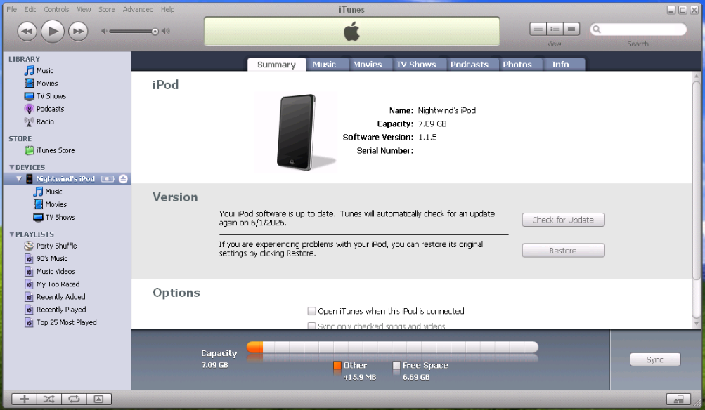

My first step was to get SSH working on the device. For that, I would have to jailbreak it and install the OpenSSH `.PXL` file onto the device using iBrickr. The jailbreak option in iBrickr 0.91 did not work for me in the virtual machine, so I had to use a different tool to jailbreak. After a day of trial and error, I found a routine that seemed to work every time. I first jailbroke the device with iLiberty+. I made sure that automatic USB passthrough was turned off. 

Images of iLiberty+:

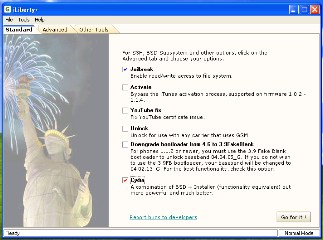

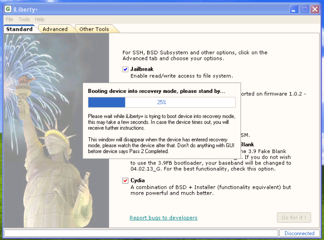

What I found was - if I let it send the device to recovery mode, then connect the device in recovery mode to the virtual machine in the "USB Devices" tab of UTM, that would consitently do the trick. I let it jailbreak with iLiberty+ and after the process was completed, I was met with the iPhone OS 1 homescreen with a very old version of Cydia installed. 

Upon opening the app, I was met with a familiar, but fairly different page:
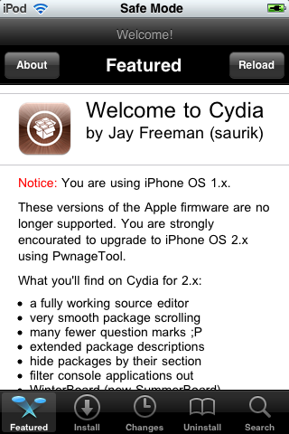

However, Cydia on this version of iPhone OS was not functional. Refreshing any sources would result in a huge list of errors.

The next step was to jailbreak using ZiPhone. I found that running the "JAILBREAK IPHONE IPOD" file directly seems to have worked. When the jailbreak finished, I was greeted yet again with the iPhone OS 1 homescreen with [Installer](https://theapplewiki.com/wiki/Installer.app), the first package manager for iOS. After some digging online, I did see that there were still some repos (in the single digits) that were still up. However, I figured that repos being down did not matter - I would just use iBrickr to install the `.PXL` files directly.

I then proceeded to use iBrickr. I found that version 0.91 seems to work well with iPhone OS 1.1.5 (unsure about other versions). 

Image of iBrickr:

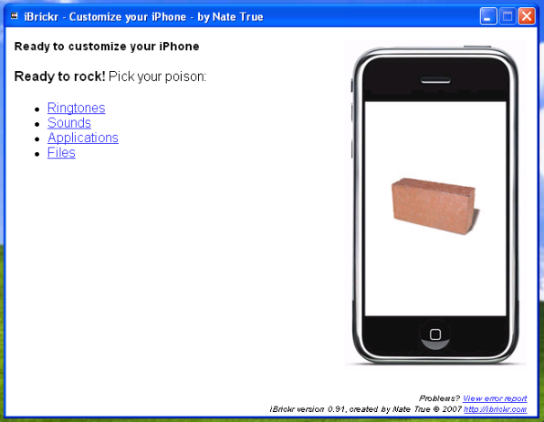

I installed the PXL daemon as instructed, ran the check, and it seemed that I had successfully gotten the PXL daemon working! I proceeded to install an OpenSSH `.PXL` that I found. Holding my breath, I typed in the `ssh` command on my Mac, fully sure that something would break.

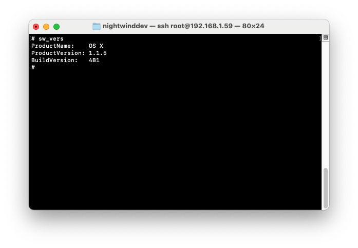

We're in.

## Testing out the environment
Up to this point, I had set up a proper working jailbreak environment. I could manipulate files with `ssh` and copy files to and from the device using `scp`. Great! Now what?

I decided the next step should be to create a simple binary to test out the environment I was working with. Since iPhone OS 1 is so old, I was expecting some challenges to arise. However, I didn't expect there to be quite as many as there actually was.

An obvious starting point for these kinds of projects would be to do a basic "hello world" console output. So, I started with that - just a basic C program:
```c
#include <stdio.h>

int main(void) {
    printf("Hello, world!\n");
}
```

I quickly realized there was a problem - the architecture I were working with here was armv6<sup>[4]</sup>. I was worried a modern version of `clang` would struggle with it. However, to my surprise, even the version of clang that shipped with most up-to-date version of Xcode as of early 2026, Xcode 26, seemed to compile the program completely fine! I copied over the binary to `/usr/bin/test` on the device and ran `chmod +x /usr/bin/test` to give it executable permissions.

Sadly, it seemed to run into a "bus error" every time I tried to run it. I suspected there was something in the toolchain that was breaking the execution. I replaced this with a much more rudimentary test:
```c
void _start(void) {
    const char msg[] = "Hello, OS1\n";

    __asm__ volatile(
        "mov r0, #1\n"
        "mov r1, %0\n"
        "mov r2, #10\n"
        "mov r12, #4\n"
        "swi 0x80\n"
        :
        : "r"(msg)
        : "r0", "r1", "r2", "r12"
    );

    while (1);
}
```
Interestingly, this ran just fine and the message was printed to `stdout`. In the Theos Discord server, [EthanArbuckle](https://github.com/EthanArbuckle) pointed out that the `crt1.o` file may be at fault. After doing some research on this file, it turned out that it was the actual entry point to executables and consisted of some setup, including stack initialization, library initialization functions, etc. before handing control over to `main`. Ethan provided me with a custom `crt1.o` file that he found from an old unofficial iPhone OS 1 development toolchain. I used that file instead. And... 

It... ran! Suprisingly. 

I figured that since this was a plain C program with no Objective-C, it would run without much issues. In fact, I was later told that a large amount of standalone binaries compiled or iPhone OS 2 which contained no Objective-C ran perfectly fine on iPhone OS 1.

Great! I then went to do the same thing in Objective-C:
```objc
#import <Foundation/Foundation.h>

int main(void) {
    NSAutoreleasePool *const pool = [[NSAutoreleasePool alloc] init];
    NSLog(@"Hello, world!");
    [pool drain];
}
```

I then compiled it, not sure how it would go: `clang -isysroot $THEOS/sdks/iPhoneOS5.1.sdk -arch armv6 -Wall -Werror -lobjc -framework Foundation -framework CoreFoundation -fno-objc-arc -miphoneos-version-min=1.0 main.m -o test` (the iOS 5.1 sdk was the earliest one I could find at the time that seemed to have worked).

I sent the binary over to my device using `scp`, held my breath, and ran the command:
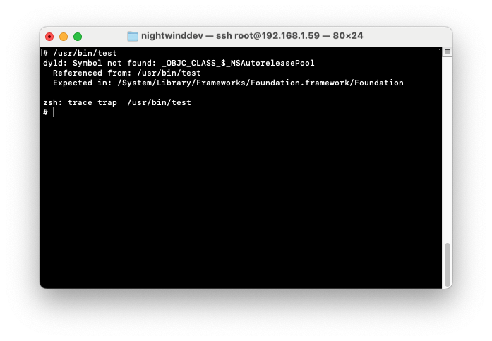
Uh oh. This can't be good.

I had my suspicions that the Objective-C runtime wouldn't "just work" on the device, but I didn't realize how core the issue would be. I found the article about [Toolchain 1.0](https://theapplewiki.com/wiki/Dev:Toolchain_1.0) on The Apple Wiki, believing it could help fix the problem. I then realized that all of this tooling is more than a decade and a half old at this point and would not run on my Mac.

I then remembered that on modern iOS, we use v2 of the Objective-C runtime. I thought - surely there is no way that iPhone OS 1 was so old that it was using v1 of the Objective-C runtime...

The legacy Objective-C runtime had some differences in regard to instance variables and such<sup>[5]</sup> - so I thought I would do some digging to figure out what the issue was.

I figured it would be best to make sure the `NSAutoreleasePool` class exists before going down a rabbithole. I copied over the Foundation binary from my iPod touch to my Mac and ran `otool -l` on it to see its load commands. Upon examining them, I noticed a bizarre `__OBJC` segment which I had never encountered before. I looked at the symbols that compiler exported for the Objective-C classes - speciically `NSAutoreleasePool`.

I was met with an interesting symbol name - `.objc_class_name_NSAutoreleasePool`. Up to that point, I had never encountered this naming convention for classes. I went to GitHub and searched both prefixes under one query. Turns out the `.objc_class_name` prefix was a signifier of the legacy Objective-C runtime<sup>[6]</sup>.

### Objective-C runtime struggles
I thought it would be best to experiment with what I could work with before trying new things. I quickly wrote a test to see if any part of the Objective-C runtime worked:
```objc
#import <Foundation/Foundation.h>
#import <objc/runtime.h>

@interface Test : NSObject
@end

@implementation Test
@end

int main(void) {
    const Class cls = objc_getClass("Test");
    printf("Test = %p\n", cls); 
}
```
Upon trying, I saw this:
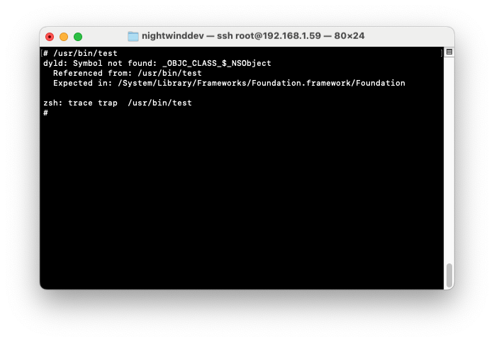

Okay, I thought, I suppose that makes sense. I removed the inheritance from `NSObject` and added `__attribute__((objc_root_class))`<sup>[7]</sup>, recompiled it, and was met with: 
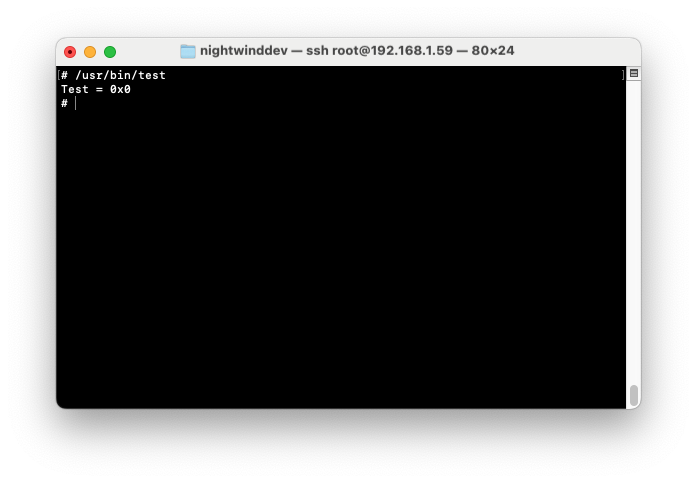

This left me slightly stumped. I tried adding a print statement to the `+ (void)load` method of the class - it did not get printed. So, it looks like the class was just being ignored by the Objective-C runtime? 

I looked carefully at the symbols of my binary. I noticed something quite interesting. The symbol emitted by the compiler for the class was `_OBJC_CLASS_$_Test`. I figured that since we were working with the legacy Objective-C runtime, it was literally not registering the new class whatsoever.

I figured there was no way to go around figuring out how to jerryrig modern `clang` to use the legacy Objective-C runtime. I came across an interesting post on LLVM forums titled [RFC: Deprecating obsolete ObjC features](https://discourse.llvm.org/t/rfc-deprecating-obsolete-objc-features/73560). A user by the name of Endill mentions that they propose "to deprecate `-fobjc-runtime=macosx-fragile`, `-fobjc-subscripting-legacy-runtime`, and `-rewrite-legacy-objc` in 18 release, remove in 19." That was my first time hearing of these compiler flags.

I searched up `-fobjc-runtime` and came across some documentation on https://clang.llvm.org<sup>[8]</sup>:

| Name | Description |
|-|-|
| `MacOSX` | '`macosx`' is the Apple-provided NeXT-derived runtime on Mac OS X platforms that use the non-fragile ABI; the version is a release of that OS. |
| `MacOSXFragile` | '`macosx-fragile`' is the Apple-provided NeXT-derived runtime on Mac OS X platforms that use the fragile ABI; the version is a release of that OS. |
| `iOS` | '`ios`' is the Apple-provided NeXT-derived runtime on iOS or the iOS simulator; it is always non-fragile. The version is a release version of iOS. |
| `WatchOS` | '`watchos`' is a variant of iOS for Apple's watchOS. The version is a release version of watchOS. |
| `GCC` | '`gcc`' is the Objective-C runtime shipped with GCC, implementing a fragile Objective-C ABI |
| `GNUStep` | '`gnustep`' is the modern non-fragile GNUstep runtime. |
| `ObjFW` | '`objfw`' is the Objective-C runtime included in ObjFW |

I added `-fobjc-runtime=macosx-fragile` to the compiler flags. Surely that should fix it? Well - it *compiles*, but there's an issue with the linker - `ld64`:

Well that's quite annoying...

I went and found the relevant file in the `ld64` source code on GitHub<sup>[9]</sup>. Sure enough, the assertion was present:
```cpp
template <typename A>
bool ObjC1ClassSection<A>::addRelocFixup(class Parser<A>& parser, const macho_relocation_info<P>* reloc)
{
	// inherited
	FixedSizeSection<A>::addRelocFixup(parser, reloc);
	
	assert(0 && "needs template specialization");
	return false;
}
```

I cloned `ld64` onto my Mac to start building it manually. I found a GitHub repo with details on how to build `ld64` from source<sup>[10]</sup>. I followed the instructions there to get a baseline build working. Surprisingly, it compiled just fine with the versions of `tapi`, `dyld`, and `cfe` mentioned in the GitHub repo. Some tweaks were necessary (in regards to include paths, `SDKROOT`, and finding some private headers), but it compiled fine! I still got the error though.

I looked carefully at the file. It seemed the have a very particular structure. I looked up `"needs template specialization"` in the file and it appeared twice. One of the occurrences was in `ObjC1ClassSection<A>::addRelocFixup` and the other was in `Objc1ClassReferences<A>::addRelocFixup`. It looked like there wasn't an actual implementation for `arm` for the legacy Objective-C runtime.

I looked right below `ObjC1ClassSection<A>::addRelocFixup` and noticed the `x86` template specialization - `ObjC1ClassSection<x86>::addRelocFixup`. Out of curiosity, I copied it and just replaced all the occurrences of `x86` with `arm`. Surely that wouldn't work, right? Surely there was a reason no one had written a proper template specialization...

I did the same with `Objc1ClassReferences<A>::addRelocFixup`. I compiled `ld64` from that modified source.

Without much faith, I decided to try the custom `ld64` with the file. I found the `-fuse-ld` flag that would allow me to specify a custom linker that `clang` would use. I then ran the compile command. It worked! No other linker errors (I've cleaned up the instructions and put a build script on the [ld64-build](https://github.com/theiphoneos1project/ld64-build) repo). That was a good sign - now I just needed to test it on device.

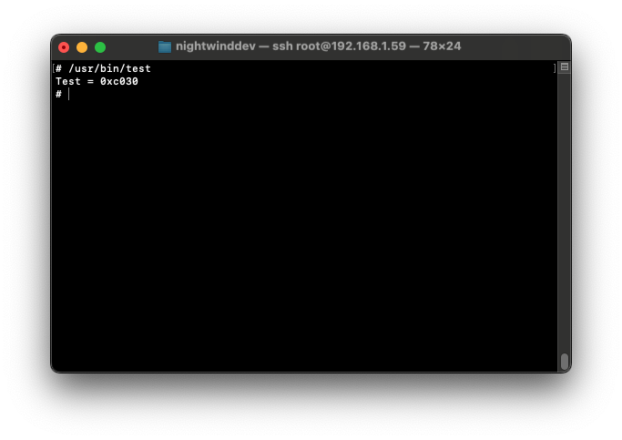

Success! That was surprisingly easy in the end.

## Take two at the tweak injection
Since I now had a working Objective-C runtime, I thought it would be the perfect time to start developing the tweak injector. I extended the test program to add some methods to the `Test` class to start implementing Objective-C hooking.

Naturally, I started off by implementing `MSHookMessageEx`. It was quite simple - just using the Objective-C runtime to set the implementation of the method as necessary and copying the pointer to the original implementation.

I decided to look at [CydiaSubstrate.h](https://github.com/theos/lib/blob/master/CydiaSubstrate.framework/Headers/CydiaSubstrate.h) to continue seeing which APIs I needed to implement. I noticed quite a peculiar function called `MSHookMessage`. I had heard of it previously but never paid much attention to it since it was deprecated long ago<sup>[12]</sup>. I decided to implement it for completeness sake - it wasn't that difficult.

I proceeded to then implement `MSFindSymbol` and `MSGetImageByName` - making these was quite simple. I had already written a private symbol lookup function a while back for another project, so adapting it for 32-bit was not a huge problem. Most of it just consisted of stripping the `_64` suffix from the types. 

It came to the part I was most dreading - `MSHookFunction` and `MSHookMemory`. So instead of implementing them, I decided to write some unit tests for the existing functions to prolong not working on them as long as possible :). They can be found in the [tests](tests/) directory. I made sure to test as thoroughly as possible to make sure all cases were covered - I actually uncovered interesting bugs that took quite a bit of iteration to solve, such as bugs relating to inheritance and making sure hooks are propogated correctly.

I asked for some help on the r/jailbreak Discord server for the task of implementing `MSHookFunction` on armv6. Luckily, [staturnz](https://github.com/staturnzz), once again, came to the rescue. After his help with [rootless-patcher](https://github.com/NightwindDev/rootless-patcher) (without which it would not be possible), I was sure he would help a ton. And he did! Almost the entirety of [HookFunction.c](HookFunction.c) was written by him, with some minor adjustments from my side.

As for `MSHookMemory` - I used staturnz's implementation of `MSHookFunction` as inspiration along with some trial-and-error and wrote a simpler hooking mechanism for raw memory.

### Expanding the tweak injection systemwide
I had tweak injection working in my test sandbox environment. However, we now needed to get tweak injection working systemwide. This would prove to be quite a challenge.

I contacted [EthanArbuckle](https://github.com/EthanArbuckle) on the Theos Discord to investigate the matter. He had previously made a project for tvOS injection<sup>[13]</sup>, so I figured that would be of help here. The way it worked was quite intriguing. It is a standalone executable that runs very early during boot and injects a dylib into the already-running `launchd` process. This was interesting to me - I was always under the impression that injection had to happen as the process started and could not be done after.

I decided not to start with that method as it could get quite complicated. Instead, my initial attempt consisted of an attempt to hardcode a load command into `launchd` and replace it on my device. I wrote a very basic constructor for the `dylib`:
```c
__attribute__((constructor))
static void MicroInjectorInit(void) {
    FILE *const file = fopen("/Library/MicroInjector/log.txt", "a");
    if (file == NULL) {
        return;
    }

    mach_port_t launchd_task;
    kern_return_t kr = task_for_pid(mach_task_self(), 1, &launchd_task);

    fprintf(file, "task_for_pid(1) = %s\n", mach_error_string(kr));
    fprintf(file, "uid = %d, pid = %d\n", getuid(), getpid());

    fclose(file);
}
```

It did not seem to log, which was quite dissapointing. Nevertheless, I was sure it would work. I decided to test it in a more radical way: `*((volatile int *)0) = 0;`. I tried that and the device was permanently stuck on the Apple logo! Progress(?)

I restored the device with iTunes 7.5 on Windows XP, did the whole jailbreak process again, and thought about how I should test in a recoverable way. Clearly, it was getting injected, but I wanted some sort of log to show up. Ethan suggested to write to `/tmp` instead of `/Library/MicroInjector` and that seemed to work! Some sort of permissions issue, probably.

```
[+] MicroLoader ran: PID=1 PPID=0 UID=0 EUID=0
```
Very nice.

I decided to then test hooking `posix_spawn` to apply the injection systemwide. After installing and rebooting, nothing seemed to happen. I then tried hooking `execv` - it turns out that doing that may not have been the best idea. 

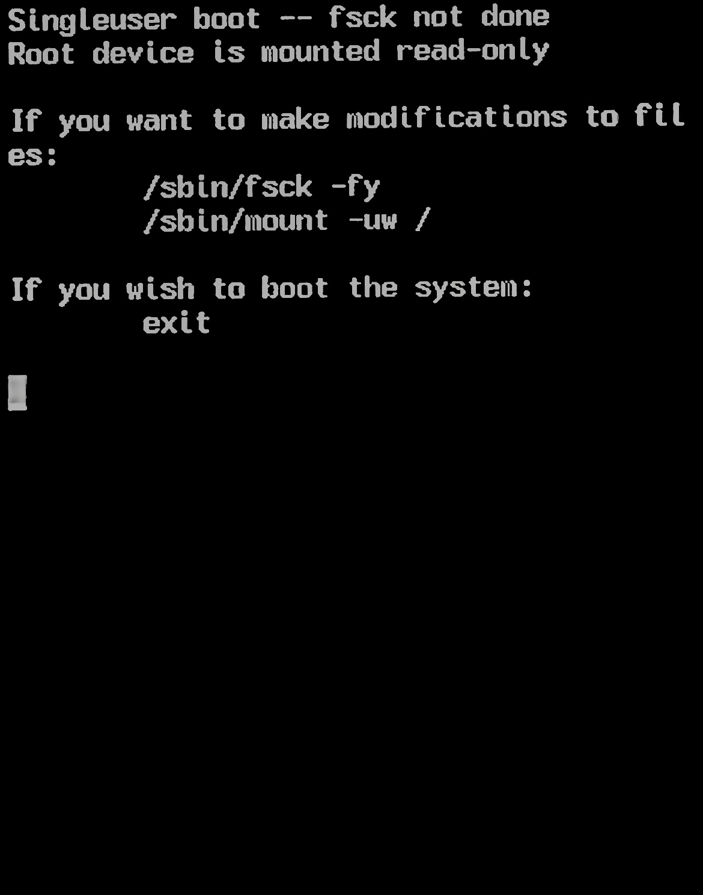

I got this bizarre message when trying to boot the device. I tried lots of things - it seems like even adding a simple log caused this issue to happen. So, I ended up looking for an alternative.

[doraorak](https://github.com/doraorak) on Discord suggested to try `DYLD_INTERPOSE`<sup>[14]</sup>. I had heard of this method of function hooking previously, so I decided to try it. Unfortunately, upon trying, it did not seem to have any effect - no logs were printed and the device booted normally.

After some fiddling with a `LaunchProxy` binary I found on the device, I decided it was time to go a different direction. I had heard of someone developing a QEMU-based simulator of an iPod touch 1st generation on iPhone OS 1<sup>[15]</sup>. I decided that instead of restoring my real iPod touch, it would make more sense to get a proof-of-concept working on the simulator and then work on getting it working on the real device.

That ended up being quite a good investment. I could see serial logs and was also able to try things out without having to restore the entire device every time. I put `launchd` in a decompiler and looked carefully at the xrefs. I noticed some calls to `execve` (not `execv`). I started to consider hooking that function instead.

After some work, I seem to have gotten something working! The implementation is found in [launchd_trampoline.c](launchd_trampoline/launchd_trampoline.c).

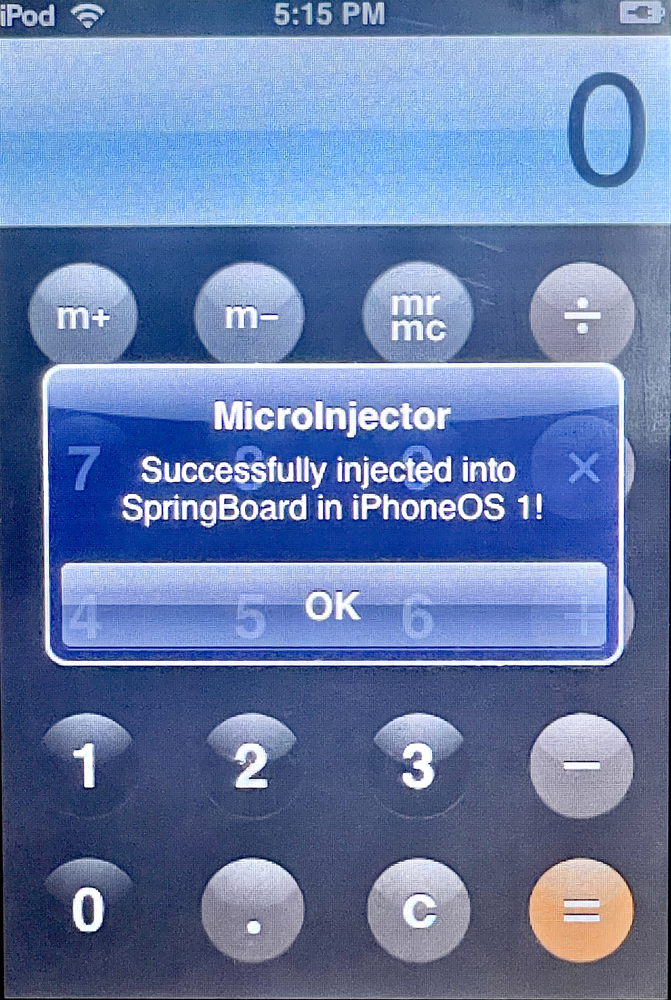
Seeing the UI show up on a real device gave a great boost of confidence to keep working on the project!

Now that tweak injection was working, I decided to implement a basic filter for tweak injection, similar to how Cydia Substrate and modern tweak injectors<sup>[16]</sup> do it. With some inspiration from ElleKit and some trial and error, I managed to get that working. 

The next step was getting Safe Mode working since I did not want to keep restoring the device (even still) when making changes. I had already figured out how to present an alert (with the `UIAlertSheet` deprecated API) when I made that test alert. I put `SpringBoard` into a disassembler to figure out what APIs to use, and found `SBAlertItemsController`. I managed to make a class at runtime for my custom `MISafeModeAlertItem` subclass of `SBAlertItem` and implemented the necessary methods. 

Then came the interesting part - how should I handle the actual exceptions and crashes? I had never handled those types of things before, so I was intriguied. I found a resource<sup>[17]</sup> which highlighted [`NSSetUncaughtExceptionHandler`](https://developer.apple.com/documentation/foundation/nssetuncaughtexceptionhandler(_:)?language=objc). That was my first time seeing that function, and I was quite intriguied. I wrote a basic tweak to send a message with an unrecognized selector to a class when the power button is pressed in order to diagnose if the Safe Mode was working correctly.

I then implemented a basic callback for the function with a log of the exception to make sure we were hitting the exception correctly. After some trial and error with the paths, I managed to log the exception to `/var/mobile/SBLog.txt`.

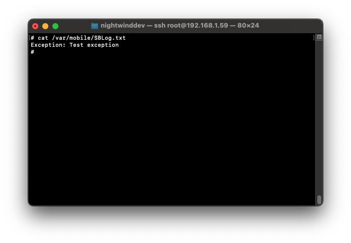

Great! As my next step, I wanted to get an actual "safe mode" working. So, I decided to look at how the ElleKit tweak injector approached this. I found the piece of code - it seems to create a file called `.eksafemode`<sup>[18]</sup> when entry to safe mode was necessary and removing it when it was necessary to exit.

I decided to mirror something of the sort. I made the callback make a marker file at `/var/mobile/.misafemode`. To the constructor of the `MicroLoader.dylib`, I added a check for the file - if the loader is injected in SpringBoard and the file is present, we do the necessary things - present the alert at launch, present the alert when the user taps on the status bar, and change the status bar time to "Safe Mode."


Hurray!

In the same blogpost, I also came across the `signal` function, which is quite similar to the `NSSetUncaughtExceptionHandler` function. Both are callback-based. I implemented that function as well with the same logic as the exception one. I used `__builtin_trap();`<sup>[19]</sup> to test if it was working. It did!

### Remote injection
There was a chicken-and-egg situation at hand: we needed code to be injected into `launchd` which spawns all other processes (including `SpringBoard`) but we couldn't just add `DYLD_INSERT_LIBRARIES` to whatever was spawning `launchd` since we'd have to now have custom code injection there too. As mentioned previously, up to this point, I had been adding a load command manually to the `launchd` binary and then `scp`'d it into the device. However, that is not portable. I needed to implement [EthanArbuckle](https://github.com/EthanArbuckle)'s idea of remote injection. Luckily, after contacting him, he gave a working proof of concept for remote dylib injection. With more help from [staturnz](https://github.com/staturnzz), there was a fully working proof of concept.

I managed to implement the remote injection in a daemon loaded at launch - `inject_launchd`. I implemented that by making `launchd` read it as a simple LaunchDaemon that had to get executed right after itself. After some trial and error, I confirmed that it works to a good extent. I restored the iPod touch a couple of times to make sure it is implemented in a consistent way. Everything looked good!

### Packaging in a `.PXL` format
The last step was to figure out how to properly package the tweak injector in a `.PXL` format. There was near zero information online about this format. The most helpful information was on The Apple Wiki, with a brief overview of the file structure of a `.PXL` archive. 

Most mentions I came across discussing the `.PXL` format likened it to the modern `.ipa` format<sup>[20]</sup>. Instead of looking at the format through that lens, I chose to think of it as the equivalent to a `.deb` file. `.deb` files can contain tweaks AND apps, and there was no reason that `.PXL`'s theoretically couldn't as well. Modern jailbreaks (and by modern I mean everything from iPhone OS 2 until now), use `dpkg` and `apt` for their package management. iPhone OS 1 never had this luxury, as far as I can tell - and therefore only ever supported the `.PXL` format.

The most interesting file in the whole package was the `PxlPkg.plist`. I chose to think of it as the rudimentary equivalent to a `control` file on modern `.deb` files. I found a couple of examples of this file online in very old projects on GitHub<sup>[21]</sup>. Notably, I noticed that there was no system of dependencies or conflicts, which I found quite interesting. It really showed how rudimentary the package format is.

Anyway, I made a basic `PxlPkg.plist` inspired by the famous SummerBoard tweak<sup>[22]</sup>. 
- Sidenote: it turns out that the way SummerBoard accomplished its tweak injection was to modify `SpringBoard`'s LaunchDaemon `.plist` to add a `DYLD_INSERT_LIBRARIES` for its own "tweak loader" (which only loaded SummerBoard). This was a good system, but it would not scale for multiple tweaks.

Instead of making an `app` directory like how many `.PXL`'s of the time did, I chose to think of the `instroot` folder as an equivalent of the `layout` folder in modern `.deb` files.

With some effort, I managed to put together a basic `.PXL` file to be installed through iBrickr. During this journey, I realized that iBrickr, while being quite a capable piece of software for its time, is quite buggy (at least in a Windows XP VM environment). There was often an error about `app.pxl` not having correct permissions whenever I installed some `.pxl` files. I found that going into the folder where `ibrickr.exe` resided and deleting `app.pxl` upon failed test installations usually did the trick.

## Credits
- [EthanArbuckle](https://github.com/EthanArbuckle) - significant help in figuring out the various quirks of the obscure production environment
- [staturnz](https://github.com/staturnzz) - armv6 C function hooking mechanism
- [devos50](https://github.com/devos50) - iPod touch 1st Generation iPhone OS 1.1 QEMU-based emulator 
- [Evelyn](https://github.com/tealbathingsuit) - open source ElleKit tweak injector, incredibly helpful resource

## References
- [1] https://www.macworld.com/article/191522/touch115.html
- [2] https://support.apple.com/en-us/103076
- [3] https://youtu.be/AkgtvBX1kkE
- [4] https://theapplewiki.com/wiki/ARM#ARMv6
- [5] https://leopard-adc.pepas.com/documentation/Cocoa/Conceptual/ObjCRuntimeGuide/ObjCRuntimeGuide.pdf
- [6] https://github.com/wushuangys/objc4Demo/blob/ceca0296fef28982c3b717cf3201784b847867b9/objc4-838-main/runtime/objc-sel-table.s#L39-L47
- [7] https://clang.llvm.org/docs/AttributeReference.html#objc-root-class
- [8] https://clang.llvm.org/doxygen/classclang_1_1ObjCRuntime.html
- [9] https://github.com/apple-opensource/ld64/blob/master/src/ld/parsers/macho_relocatable_file.cpp
- [10] https://github.com/dmaclach/ld64
- [11] https://clang.llvm.org/docs/ClangCommandLineReference.html
- [12] https://www.cydiasubstrate.com/api/c/MSHookMessage/
- [13] https://github.com/EthanArbuckle/tvos-injection/blob/main/src/launchd_injector.m
- [14] https://www.emergetools.com/blog/posts/DyldInterposing
- [15] https://devos50.github.io/blog/2022/ipod-touch-qemu/
- [16] https://github.com/tealbathingsuit/ellekit/blob/6c4a325e81f92116087662e929a5a34bd9e992c7/injector/injector.c#L66-L234
- [17] https://www.cocoawithlove.com/2010/05/handling-unhandled-exceptions-and.html
- [18] https://github.com/tealbathingsuit/ellekit/blob/6c4a325e81f92116087662e929a5a34bd9e992c7/sb/tweak.swift#L190-L196
- [19] https://gcc.gnu.org/onlinedocs/gcc/Other-Builtins.html#index-_005f_005fbuiltin_005ftrap
- [20] https://en.wikipedia.org/wiki/.ipa
- [21] https://github.com/gabeschine/iphone-ants/blob/c17b0a47c16cf9da10c8f92a282b935195eb874a/PxlPkg.plist
- [22] https://youtu.be/s_P_9mrZTKs

## Miscellaneous Resources
- https://archive.fosdem.org/2024/schedule/event/fosdem-2024-2826-breathing-life-into-legacy-an-open-source-emulator-of-legacy-apple-devices/
- https://umi.cat/2019/12/13/jailbreak-history-iOS1/
- https://cocoadev.github.io/UIAlertSheet/