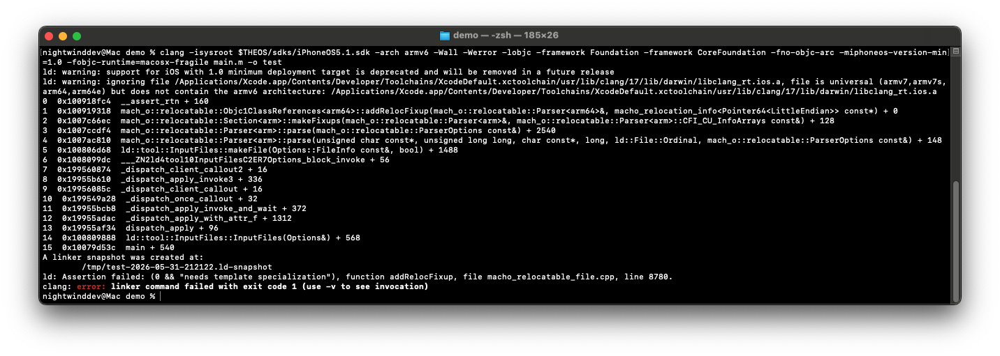

# Patching `ld64` for Objective-C 1 support
`ld64`, Apple's old static linker, is very reliable when working with modern iOS. However, when compiling for an ancient target such as iPhone OS 1, problems arise.

The notable issue when compiling with the `-fobjc-runtime=macosx-fragile` is this error:


Therefore, we need to fork `ld64` and fix this issue ourselves. We will use the latest open-source version of `ld64` at the time of writing (`ld64-957.1`).

After some work and referencing https://github.com/dmaclach/ld64, I was able to compile ld64 with support for the fragile Objective-C 1 runtime. 

The changes required to fix the issue were really only to do with some missing template specializations. This is one of the issues:
```cpp
template <typename A>
bool ObjC1ClassSection<A>::addRelocFixup(class Parser<A>& parser, const macho_relocation_info<P>* reloc)
{
	// inherited
	FixedSizeSection<A>::addRelocFixup(parser, reloc);
	
	assert(0 && "needs template specialization");
	return false;
}
```

After referencing the other specializations (specifically the `x86_64` one), it turned out that a simple drop-in of the `x86_64` specialization with the `x86` template arguments replaced with `arm` was enough to get it working!

The same needed to be done with `Objc1ClassReferences<A>::addRelocFixup`. 

You can see the changes required as well as obtain a build script for `ld64` on the [ld64-build](https://github.com/theiphoneos1project/ld64-build) repo!

Additional information about the process of figuring all of this out can be found in the [MicroInjector writeup](../MicroInjector/WRITEUP.md).